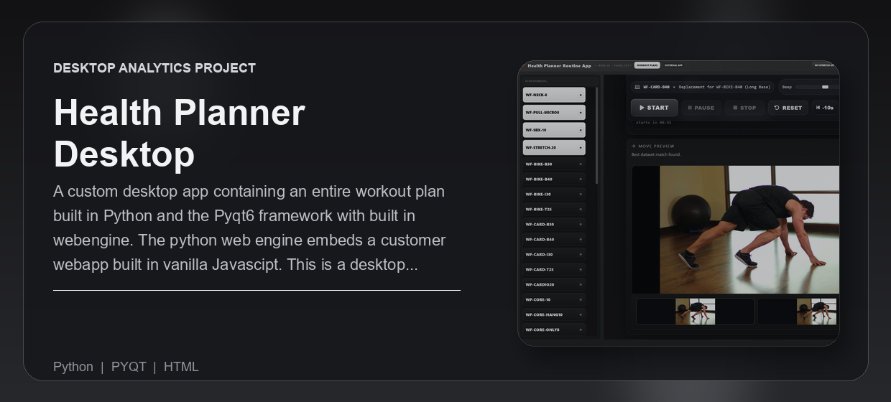
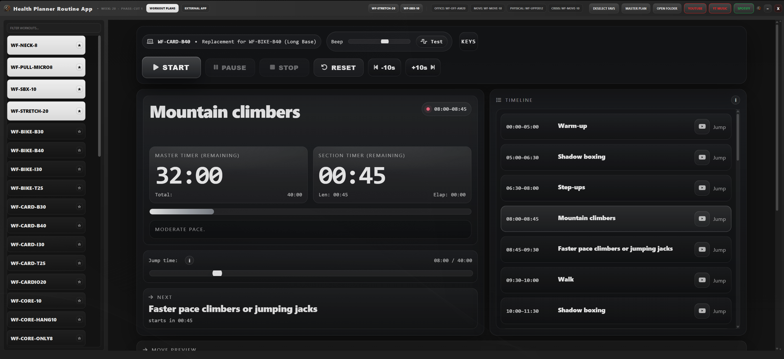
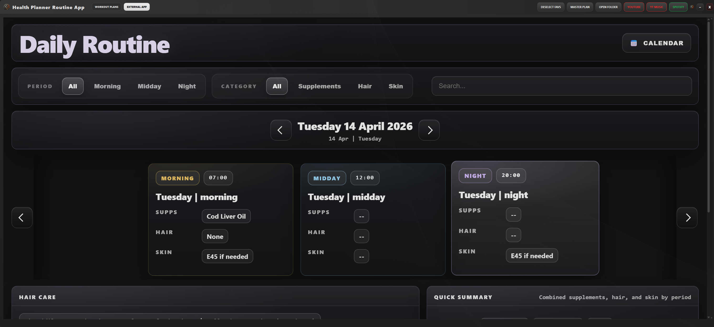
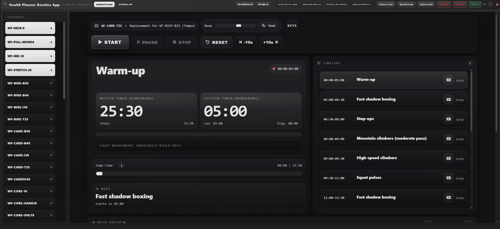

---
<div align="center">


<br /><br />

<p><strong>A custom desktop app containing an entire workout plan built in Python and the Pyqt6 framework with built in webengine. The python web engine embeds  a customer webapp built in vanilla Javascipt. This is a desktop version of a mobile app built in React Native. (see mobile section).</strong></p>

<p>Built for people who need a structured workout system on desktop without switching between spreadsheets, browser tabs, timers, and music apps.</p>

<p>
  <a href="#overview">Overview</a> |
  <a href="#what-problem-it-solves">What It Solves</a> |
  <a href="#feature-highlights">Features</a> |
  <a href="#screenshots">Screenshots</a> |
  <a href="#quick-start">Quick Start</a> |
  <a href="#tech-stack">Tech Stack</a>
</p>

<h3><strong>Made by Naadir | Dec 2025</strong></h3>

</div>

---

## Overview

Health-Planner-Desktop is a desktop workout planner and routine launcher built with Python, PyQt6, PyQt6 WebEngine, HTML, CSS, and JavaScript. The Python shell provides the native desktop window, navigation, file access, saved layout state, and master-plan integration. The embedded web app handles the workout timer, exercise timeline, section notes, progress display, and keyboard controls.

The app supports a practical daily training workflow: open the desktop app, load the workout list, filter or pin routines, launch the correct workout file, follow timed exercise blocks, and jump between sections when needed. It can also read a local `master_plan.xlsm` file to surface today's primary workout, add-ons, alternative workouts, week number, and phase directly in the header.

The result is a local-first training dashboard that turns a large workout library into a usable desktop system. It keeps the workout plan, timer, notes, Excel plan, folders, YouTube, YouTube Music, and Spotify access in one focused interface.

## What Problem It Solves

- Removes the need to manage workouts through loose HTML files, spreadsheets, browser tabs, and separate timer apps
- Replaces manual routine lookup with searchable workout cards, favourites, and today-based plan buttons
- Makes the current workout, next section, remaining time, progress, phase, week, and alternative options visible in one place
- Gives a faster local desktop workflow than opening files manually and tracking workout timing by hand

### At a glance

| Track | Analyse | Compare |
|---|---|---|
| Workout HTML files, daily primary routines, add-ons, alternatives, phase, and week | Section duration, elapsed time, remaining time, total workout progress, and current notes | Primary workout vs office, movement, physical-job, or crisis alternatives |
| Search state, pinned workouts, active page, window size, zoom, and scroll position | Excel calendar data from `MASTER_CALENDAR` and JavaScript workout block timing | Planned routine vs fallback routine for the same day |
| Local workout loading, Excel plan opening, folder access, and timer state | Timer panel, timeline list, progress bar, next-section display, and toast feedback | Time cost, intensity flow, and exercise sequence differences |

## Feature Highlights

- **Desktop workout launcher**, loads local HTML workout files inside a PyQt6 WebEngine view so the user can run workouts without leaving the app
- **Today plan header**, reads `master_plan.xlsm` and exposes today's primary workout, optional add-ons, alternatives, week, and phase
- **Searchable workout library**, filters local workout files and sorts favourites above the rest for faster access
- **Embedded workout timer**, provides master timer, section timer, progress bar, current notes, next block, timeline jumping, and audio beeps
- **Persistent desktop state**, saves window geometry, active page, zoom level, and scroll positions to a local JSON state file
- **Local app integrations**, opens the master plan, workout folder, YouTube, YouTube Music, and Spotify directly from the header

### Core capabilities

| Area | What it gives you |
|---|---|
| **Workout navigation** | A searchable list of local workout cards with pinning and one-click loading |
| **Daily plan automation** | Today-specific workout buttons generated from the Excel master calendar |
| **Timed training flow** | Start, pause, resume, stop, reset, scrub, jump, and ±10 second controls |
| **Desktop persistence** | Restores layout, zoom, scroll position, and active app state between sessions |

## Screenshots

<details>
<summary><strong>Open screenshot gallery</strong></summary>

<br />

<div align="center">
  
  <br /><br />
  
  <br /><br />
  
</div>

</details>

## Quick Start

```bash
# Clone the repo
git clone https://github.com/Naadir-Dev-Portfolio/Health-Planner-Desktop.git
cd Health-Planner-Desktop

# Install dependencies
pip install PyQt6 PyQt6-WebEngine openpyxl

# Run
python external_app_health.py
```

No API keys are required. For the full workflow, place workout HTML files inside `workout_html_files/` and provide `master_plan.xlsm` in the project root. The Today header expects a `MASTER_CALENDAR` sheet with columns such as `Primary Code`, `Add-on 1`, `Add-on 2`, `Optional Add-on (SBX)`, `Office Alternative (if commuting)`, `Move Alternative (if stress)`, `Physical Job Alternative`, `Crisis Alternative`, `Week#`, and `Phase`. Optional logos can be placed in `assets/health_logo.png` or `assets/logo.png`.

## Tech Stack

<details>
<summary><strong>Open tech stack</strong></summary>

<br />

| Category | Tools |
|---|---|
| **Primary stack** | `python` | `HTML` | `CSS` | `Javascript` |
| **UI / App layer** | PyQt6 desktop UI, PyQt6 WebEngine, embedded vanilla JavaScript workout interface |
| **Data / Storage** | Local HTML files, Excel `.xlsm` master plan, JSON state files, browser `localStorage` |
| **Automation / Integration** | Excel calendar parsing, local folder opening, YouTube, YouTube Music, Spotify URI/web fallback |
| **Platform** | Windows desktop with local-first file workflow |

</details>

## Architecture & Data

<details>
<summary><strong>Open architecture and data details</strong></summary>

<br />

### Application model

The app starts from `external_app_health.py`, resolves local project paths, creates a frameless PyQt6 desktop window, and loads two main views: the workout-plan view and the external regimen view. The workout view scans `workout_html_files/` for `.html` routines, renders them as searchable cards, and opens selected files inside a `QWebEngineView`.

The Excel workflow reads `master_plan.xlsm`, looks for the `MASTER_CALENDAR` sheet, finds the row matching today's date, and pulls primary workouts, add-ons, alternatives, phase, and week metadata into the desktop header. The embedded JavaScript workout file then handles runtime execution by converting configured exercise blocks into timed sections, updating the timer UI, saving session state, and supporting timeline jumps, scrubber changes, keyboard shortcuts, and audio cues.

### Project structure

```text
Health-Planner-Desktop/
+-- external_app_health.py
+-- workout_html_files/
+-- regimen_plan/
+-- README.md
+-- repo-card.png
+-- portfolio/
    +-- health-planner-desktop.json
    +-- health-planner-desktop.webp
    +-- Screen1.png
    +-- Screen2.png
    +-- Screen3.png
```

### Data / system notes

- Workout routines are local HTML files; the timer data is defined inside each workout file through JavaScript exercise objects with titles, durations, and notes.
- App state is stored locally in `widget_positions/` as JSON, while timer progress and beep volume are stored in browser `localStorage`.
- The project is local-first and does not require cloud services, external APIs, authentication, or network access for the core workout workflow.

</details>

## Contact

Questions, feedback, or collaboration: `naadir.dev.mail@gmail.com`

<sub>python | HTML | CSS | Javascript</sub>

---
